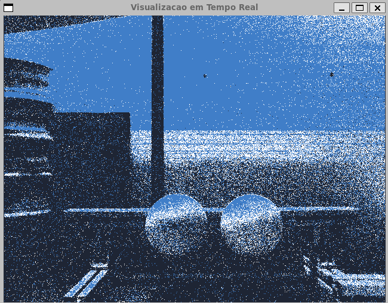
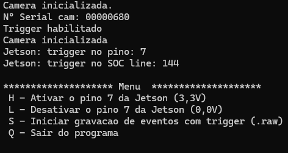

### Trigger de hardware da SilkyEvCam através do IO da Jetosn Orin Nano

### Caracterpiticas do programa:
1- Visualização gráfica dos eventos em tempo real;

2- Menu de opções para testar o trigger nos pinos da Jetson

3- Salvanmdo dados da camera de eventos através de thread sincronizada com trigger de eventos 
com duração variável.